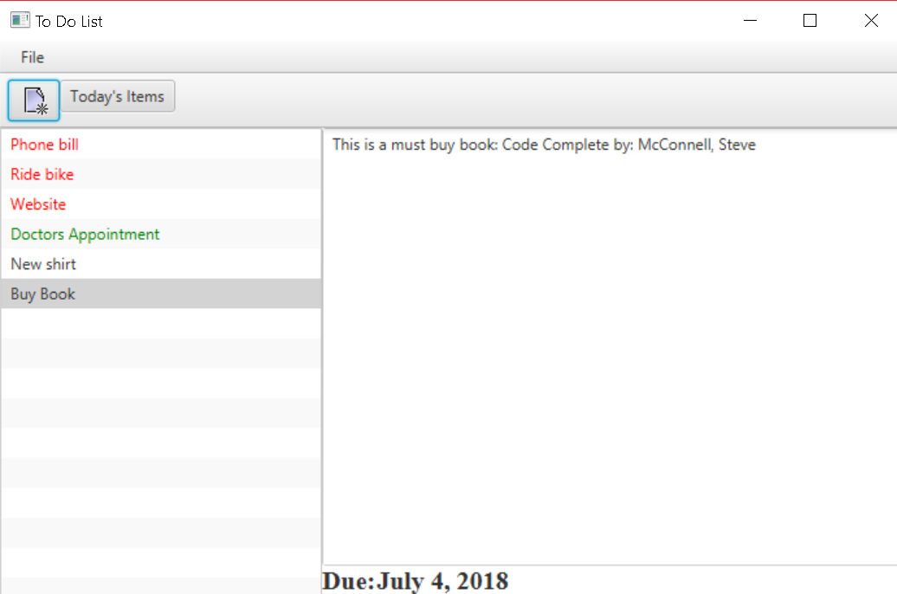
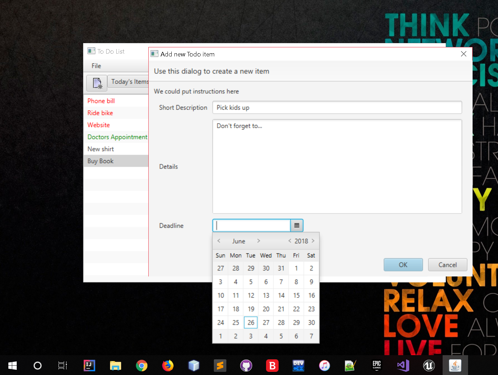
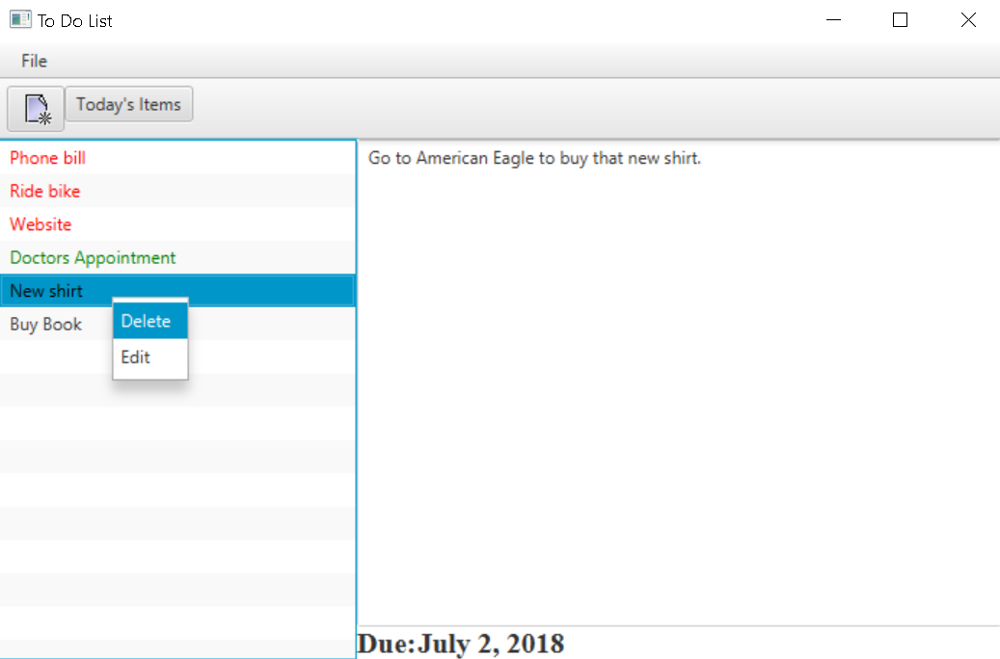
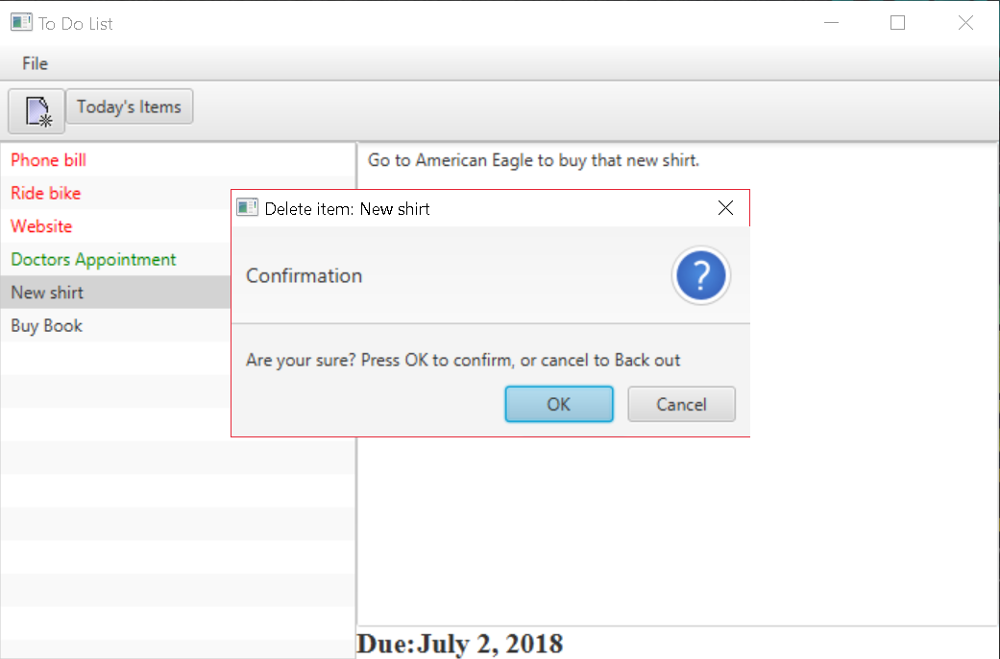
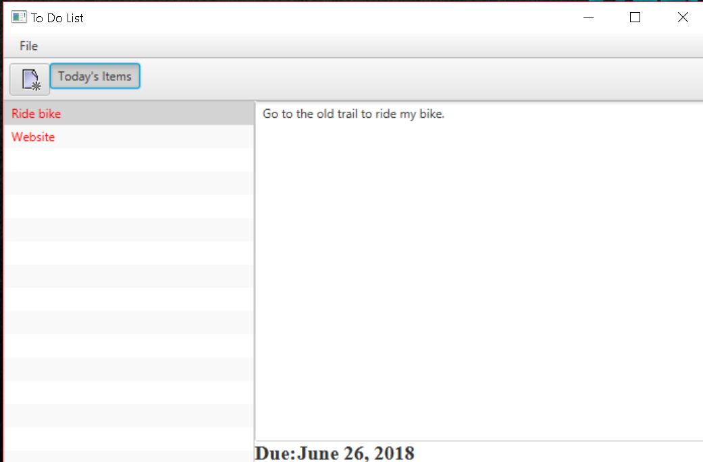

# To-do-List-

Todo list desktop Application that keeps track of tasks that include short description, details, and deadline date. Allows a user to perform CRUD (create, read, update, delete) operations, and stores user’s data in a text file.

## Built With

* [JavaFX](https://docs.oracle.com/javase/8/javafx/api/toc.htm) 

## Authors

* **Idris Bowman** 

